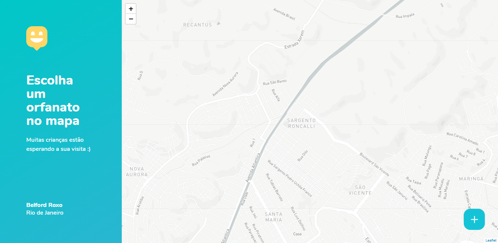
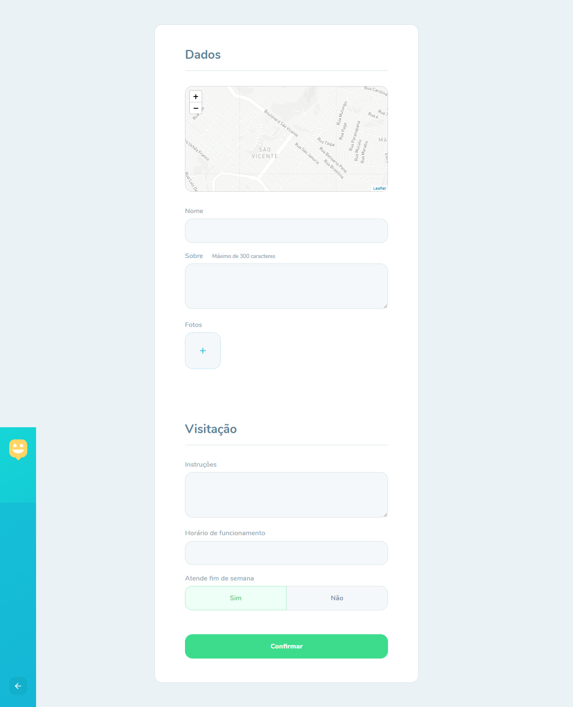

<h4 align="center">
  🚀 Happy - React and Typescript
</h4>
<h4 align="center">
 🔥 <a href="">Demo</a>
</h4>

<p align="center">
  <a href="#rocket-technologies">Technologies</a>&nbsp;&nbsp;&nbsp;|&nbsp;&nbsp;&nbsp;
  <a href="#-project">Project info</a>&nbsp;&nbsp;&nbsp;|&nbsp;&nbsp;&nbsp;
  <a href="#-layout">Layout</a>&nbsp;&nbsp;&nbsp;|&nbsp;&nbsp;&nbsp;
</p>

<br>

## :rocket: Technologies

Project made with:

- React
- Typescript
- Axios
- Styled Components

## 📌 Run

For run this project you nedded Git, Node.js and Yarn/Npm =)
```bash
## Clone repository
$ git clone https://github.com/lfnandoo/happy-frontend-web

## Enter in repository
$ cd happy-frontend-web

## Install dependences
$ yarn install
## or
$ npm install

## Start dev server
$ yarn start
## or
$ npm start

## Wait some seconds.
```

## 💻 Project

Made during "Next Level Week 3.0".

## 🔖 Layout

<p align="">
  
  
  
</p>
---

Made with 💜 by Luiz Fernando :wave: [Linkedin](https://www.linkedin.com/in/luizfernandoo/)
